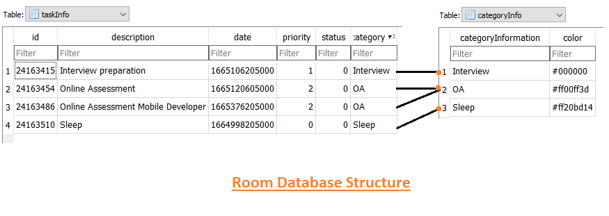

<h1>ToDoListApp</h1>

  
  
  

  
ToDoList App demonstrates modern Android development with Hilt, Coroutines, LiveData, Jetpack (Room, ViewModel), and Material 3 Design based on MVVM architecture. 

# Screenshots:
  
  
 
  

## Tech stack & Open-source libraries
- Minimum SDK level 26
- [Kotlin](https://kotlinlang.org/)
  - Lifecycle: Observe Android lifecycles and handle UI states upon the lifecycle changes.
  - ViewModel: Manages UI-related data holder and lifecycle aware. Allows data to survive configuration changes such as screen rotations.
  - DataBinding: Binds UI components in your layouts to data sources in your app using a declarative format rather than programmatically.
  - Room: Constructs Database by providing an abstraction layer over SQLite to allow fluent database access.
  - Navigation Component Graphs - To use single activity multiple fragment architecture.
  - [Hilt](https://dagger.dev/hilt/): For dependency injection.
  - [Coroutines](https://github.com/Kotlin/kotlinx.coroutines) For asynchronous programming.
- Architecture
  - MVVM Architecture (View - DataBinding - ViewModel - Model)
  - Repository Pattern
- [Material-Components](https://github.com/material-components/material-components-android): Material design components for building ripple animation, and CardView.
- [ColorPicker](https://github.com/QuadFlask/colorpicker): Simple android color picker with color wheel and lightness bar.

## Architecture
**ToDoListApp** is based on the MVVM architecture and the Repository pattern, which follows the [Google's official architecture guidance](https://developer.android.com/topic/architecture).

## Room Database Structure

